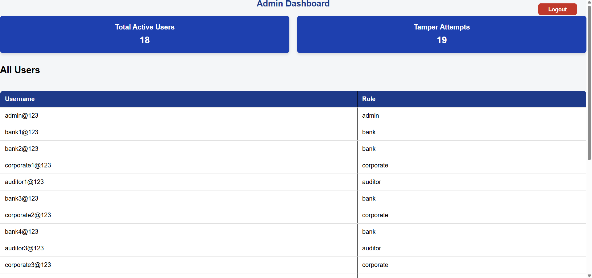
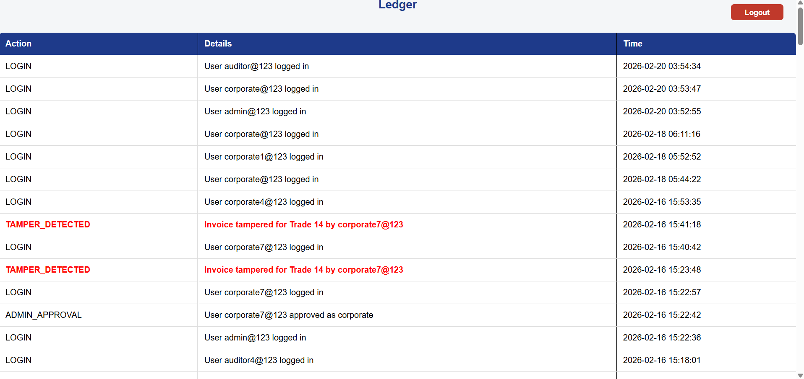
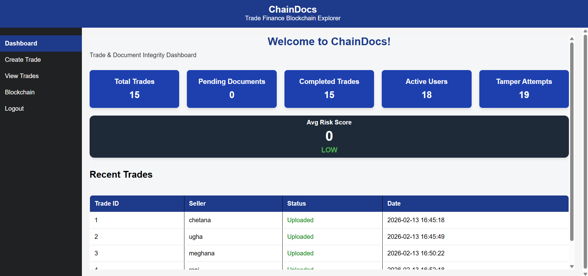
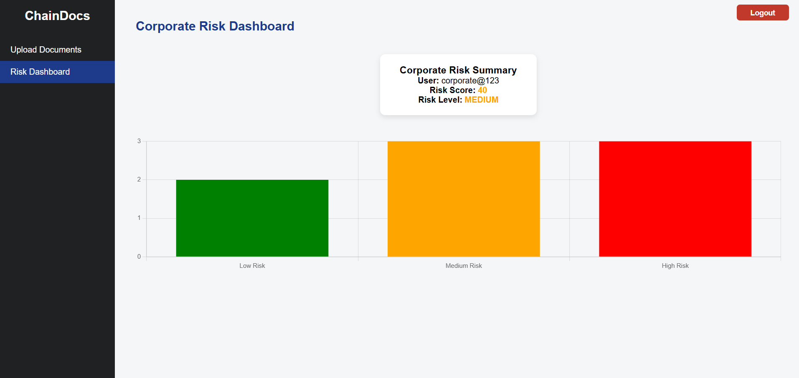
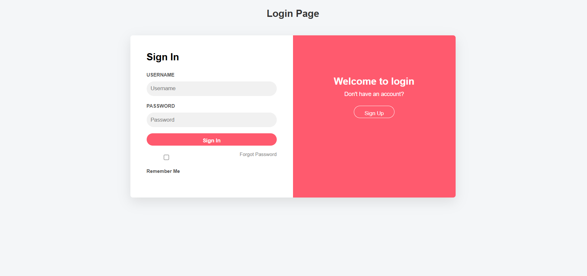

### **Trade Finance Blockchain Explorer**

---

### **Overview**

The Trade Finance Blockchain Explorer is a secure web-based application designed to manage trade finance operations and analyze corporate risk levels using blockchain principles.

---

### **The system focuses on:**

- Secure trade record management
- Blockchain-based audit logging
- Analytical risk scoring
- Visual risk dashboards for decision-making
- This project was developed as part of the Infosys Springboard Internship Program and deployed as a fully functional application.

---

### **Developer Information**

- Developer: Ughasri P

- Program: Infosys Springboard Internship

- Timeline: December 2025 – February 2026 (8 Weeks)

- Status: Production Deployed and Operational

- Email:ughasrimec@gmail.com

- Live Application

---

### **Deployment URL:** https://tradefinance-blockchain-dmxi.onrender.com

---

### **Problem Statement**

- Trade finance systems involve high-value transactions that require trust, transparency, and risk monitoring.
- Traditional systems often lack:
- Transparent audit trails
- Automated risk evaluation
- Visual analytics for corporate risk
- This project solves these challenges by integrating blockchain-style ledgers, risk scoring algorithms, and an analytical dashboard.

---

### **Objectives**

- Secure management of trade finance records
- Maintain immutable blockchain-style ledger logs
- Detect suspicious or high-risk corporate activity
- Calculate automated corporate risk scores
- Visualize risk distribution using dashboards
- Enable role-based access for secure operations

---

### **Technology Stack**

- **Backend:** Flask (Python)

- **Database:** PostgreSQL (Production),SQLite (Development)

- **ORM:** SQLAlchemy

- **Authentication & Authorization:** JWT (JSON Web Token),Role-Based Access Control (RBAC)

- **Hashing & Security:** SHA-256 (Document Integrity Verification),PBKDF2 (Password Hashing)

- **Frontend:** HTML,CSS,JavaScript

- **Visualization & Analytics:** Chart.js (Risk Analytics & Dashboard Graphs)

- **Deployment Platform:** Render

- **Production Server:** Gunicorn

- **Version Control:** Git & GitHub

---

### **Blockchain Concept**

- Hash-based verification
- Immutable ledger logs
- Security & Access Control
- Role-based access control implemented at backend level
  
**Separate access for:**

- Corporate users
- Bank/Admin users
- Backend validation prevents unauthorized actions

---

## **User Roles**

- Corporate User
- Create and manage trade records
- Upload trade-related documents
- View personal trade and risk information
- Admin / Bank User
- View all trades
- Monitor blockchain ledger logs
- Review corporate risk levels
- Oversee system integrity

---

## **Key Features**

- Trade Management
- Create, view, and manage trade records
- Trades contribute to risk analysis
- Blockchain Ledger

## **Immutable ledger stores:**

- Trade creation events
- Document uploads
- Risk updates
- Ledger entries cannot be modified or deleted
- Risk Analysis Engine
- Automated risk score calculation
- Risk score range: 0 – 100

## **Risk level classification:**

- Low Risk
- Medium Risk
- High Risk
- Analytical Risk Dashboard
- Displays corporate risk score
- Shows risk level visually
- Bar chart visualization using Chart.js

## **Risk Scoring Logic:**

- Risk score is calculated using multiple parameters:
- Risk Score = Base Score 
           + (Trade Count × Weight) 
           + (Ledger Events × Weight)

## **Risk Levels :**

| Score Range | Risk Level   |
|------------|--------------|
| 0 – 39     | Low Risk     |
| 40 – 69    | Medium Risk  |
| 70 – 100   | High Risk    |

## **Risk score is recalculated when:**

- New trade is created
- Document is uploaded
- Ledger activity changes

## **Risk Visualization :**
 
- Implemented using Chart.js
- Bar chart shows:
- Low Risk Corporates
- Medium Risk Corporates
- High Risk Corporates
- Data fetched dynamically from backend APIs

---

### **API Endpoints :**
| Method | Endpoint  | Description                                   |
|--------|-----------|-----------------------------------------------|
| POST   | `/signup` | Register a new user                           |
| POST   | `/login`  | Authenticate user and generate session        |

---

## **Trade Management APIs :**

| Method | Endpoint        | Description                                             |
|--------|-----------------|---------------------------------------------------------|
| POST   | `/create-trade` | Create a new trade record                               |
| GET    | `/view-trades`  | View all trades (role-based access)                     |
| GET    | `/my-trades`    | View trades created by logged-in corporate user          |

---

 ## **Document Management APIs :**

| Method | Endpoint                         | Description                                           |
|--------|----------------------------------|-------------------------------------------------------|
| POST   | `/upload-document`               | Upload trade-related document                         |
| GET    | `/documents`                     | View all uploaded documents                           |
| GET    | `/my-documents`                  | View documents uploaded by logged-in user             |
| GET    | `/documents/{doc_id}/preview`    | Preview uploaded document                             |
| DELETE | `/documents/{doc_id}`            | Soft delete a document                                |
| PUT    | `/documents/{doc_id}/restore`    | Restore deleted document                              |

---

## **Document Verification APIs :**

| Method | Endpoint                       | Description                                               |
|--------|--------------------------------|-----------------------------------------------------------|
| PUT    | `/documents/{doc_id}/status`   | Verify and update document status (ACCEPTED / REJECTED)  |

---

### **Blockchain Ledger APIs :**

| Method | Endpoint                          | Description                                      |
|--------|-----------------------------------|--------------------------------------------------|
| GET    | `/ledger`                         | View complete ledger entries                     |
| GET    | `/documents/{doc_id}/ledger`      | View ledger history for a specific document      |

---

### **Risk Analysis APIs**

| Method | Endpoint                         | Description                               |
|-------:|----------------------------------|-------------------------------------------|
| GET    | `/risk-score`                    | Get risk score of logged-in user           |
| GET    | `/risk-summary`                  | Get aggregated corporate risk data         |
| GET    | `/users/{username}/risk-score`   | Get risk score of a specific user          |

---

### **Dashboard APIs**

| Method | Endpoint                  | Description                              |
|-------:|---------------------------|------------------------------------------|
| GET    | `/dashboard/summary`      | Fetch dashboard analytics data           |
| GET    | `/dashboard/trades`       | Trade statistics for dashboard           |
| GET    | `/dashboard/risk`         | Risk visualization data                  |

---

### **Frontend Pages**

- login.html

- dashboard.html

- view_trades.html

- upload_document.html

- risk.html

---

### **Application Workflow**

1. Corporate user logs in
2. Trade is created and stored
3. Ledger entry is added automatically
4. Risk score is calculated
5. Risk dashboard displays analytics
6. Admin monitors system-wide risk

---

### **Screenshots**

Include screenshots of:

- Corporate Risk Dashboard
- Risk Bar Chart
- Trade Management Page
- Ledger View

## 📸 Screenshots

### Admin Dashboard - View 1

### Admin Dashboard - View 2

### Auditor Panel

### Bank Dashboard

### Corporate Dashboard

### Sign In Page

### Sign Up Page

---

### **How to Run Locally**

Install dependencies

pip install -r requirements.txt

Run the application

uvicorn main:app --reload

---

### **Branch Confirmation**

All project code is committed to:

- TF_Blockchain--Ughasri
- 
  README updated with:
  
- Full project explanation
- Module details
- Risk logic
- Screenshots section
- Deployment link

---

### **Conclusion**

- This project demonstrates how blockchain concepts combined with analytical risk dashboards can improve transparency and decision-making in trade finance systems. The Analytical Risk Dashboard enables organizations to proactively identify and manage corporate risk.

