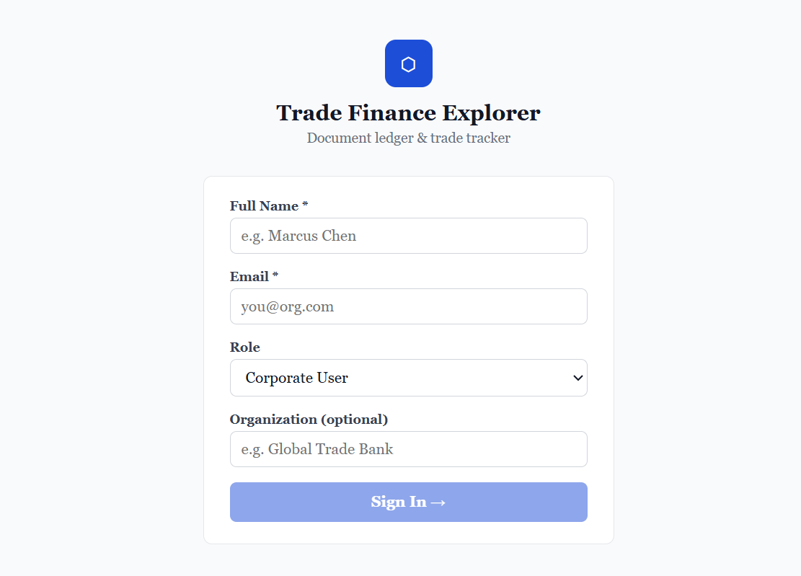
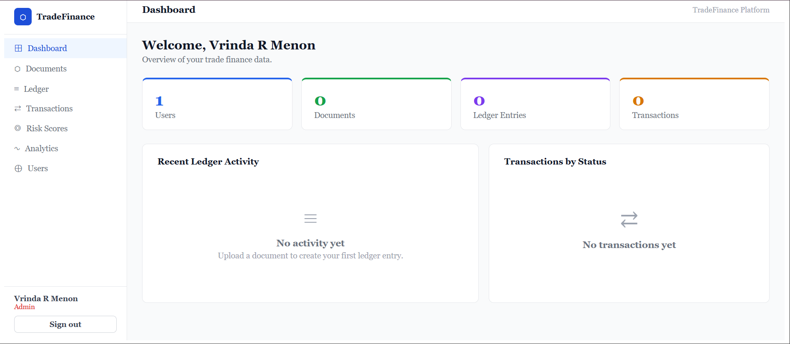
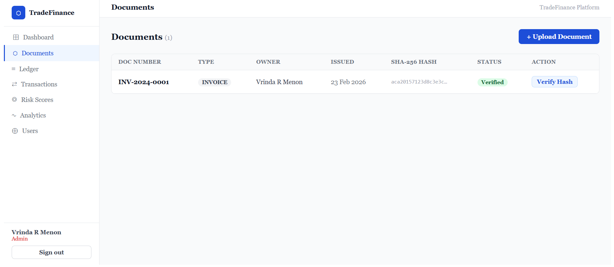
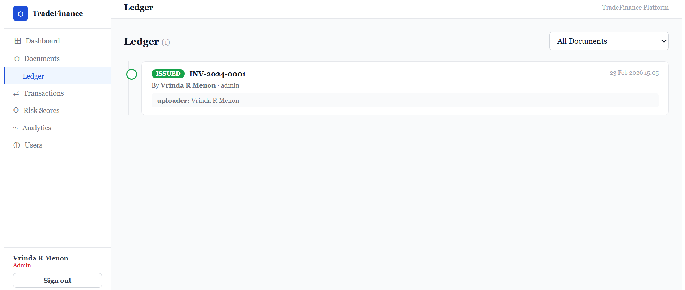
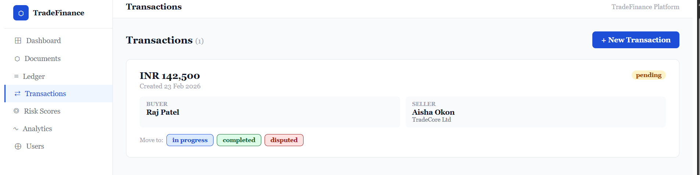
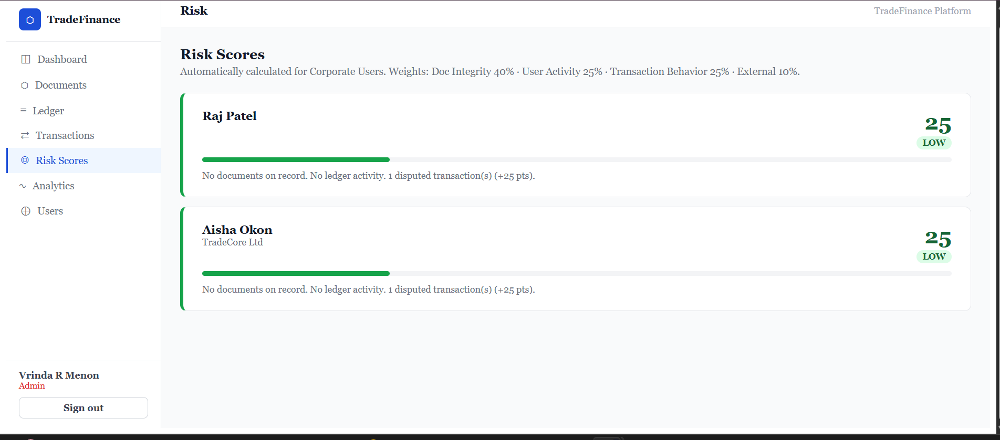
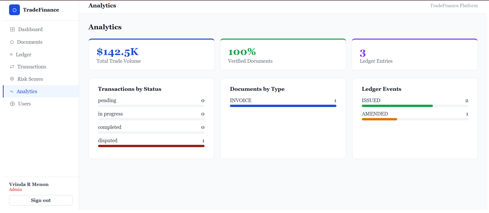

# Trade Finance Blockchain Explorer

A ledger-style web application for transparent, tamper-evident tracking of trade finance documents (Letters of Credit, Invoices, Shipping Docs) with counterparty risk scoring and audit trails.

---

## 🚀 Deployment Link

> **Live App:** `https://trade-finance-explorer.vercel.app`


---

## 📌 What This Project Does

This application provides a full trade finance management interface with five core modules:

| Module | Description |
|--------|-------------|
| **Auth & Roles** | Login with role-based access (Bank, Corporate, Auditor, Admin) |
| **Document Repository** | Upload trade documents with auto-generated SHA-256 hashes |
| **Ledger Explorer** | Tamper-proof, chronological timeline of all document lifecycle events |
| **Transactions & Risk** | Trade transaction tracking with automated counterparty risk scoring |
| **Analytics** | Live charts for trade volume, document integrity, and ledger events |

---

## 🛠 Tech Stack

| Layer | Technology |
|-------|-----------|
| Frontend | React.js (Create React App) |
| Styling | Inline styles + CSS-in-JS (no external CSS framework) |
| State | React Hooks (useState) |
| Auth | Role-based session state (JWT-ready structure) |
| Hashing | SHA-256 simulated (ready to connect to real crypto API) |
| Storage | In-memory (ready to connect to PostgreSQL + S3) |

---

## 📁 Project Structure

```
src/
└── App.js          # All modules in one file (Login, Dashboard, Documents,
                    # Ledger, Transactions, Risk, Analytics, Users)
```

---

## ⚙️ How to Run Locally

**Requirements:** Node.js (v16+) — download from [nodejs.org](https://nodejs.org)

```bash
# 1. Create a new React app
npx create-react-app trade-finance-explorer
cd trade-finance-explorer

# 2. Replace the default App.js with the project file
cp path/to/trade-finance-explorer.jsx src/App.js

# 3. Clear default styles
echo "" > src/index.css

# 4. Start the development server
npm start
```

App will open at `http://localhost:3000`

---

## 🔑 How to Use the App

1. **Sign In** — Enter your name, email, choose a role, and org name
2. **Admin role** — Can create/manage users across all organizations
3. **Bank / Corporate role** — Can upload documents and create transactions
4. **Auditor role** — Read-only access to ledger and risk reports
5. **Upload a document** → SHA-256 hash is auto-generated + ledger entry created
6. **Create a transaction** → Link it to a document; change status to trigger ledger events
7. **View Risk Scores** → Auto-calculated for Corporate users based on:
   - Document integrity (40%)
   - Ledger activity (25%)
   - Transaction disputes (25%)
   - External trade data signals (10%)

---

## 🧮 Risk Scoring Logic

Risk scores range from **0 (safe) to 100 (high risk)** and are rule-based (no ML):

```
Final Score = (Doc Failures / Total Docs) × 40
            + (Failed Ledger Events / Total Events) × 25
            + (Disputed Transactions / Total Transactions) × 25
            + External Signal × 10

Category:
  0–29  → LOW
  30–59 → MEDIUM
  60+   → HIGH
```

All calculations happen in the frontend service layer, ready to be moved to a FastAPI backend.

---

## 📸 Screenshots

> Add screenshots to a `/screenshots` folder in this repo and link them below:

```
screenshots/
├── 01-login.png
├── 02-dashboard.png
├── 03-documents.png
├── 04-ledger.png
├── 05-transactions.png
├── 06-risk-scores.png
└── 07-analytics.png
```

| Screen | Preview |
|--------|---------|
| Login |  |
| Dashboard |  |
| Documents |  |
| Ledger |  |
| Transactions |  |
| Risk Scores |  |
| Analytics |  |

---

## 🗄 Database Schema (Planned Backend)

| Table | Key Fields |
|-------|-----------|
| `Users` | id, name, email, role (bank/corporate/auditor/admin), org_name |
| `Documents` | id, owner_id, doc_type, doc_number, file_url, hash, verified |
| `LedgerEntries` | id, document_id, action, actor_id, metadata, created_at |
| `TradeTransactions` | id, buyer_id, seller_id, amount, currency, status |
| `RiskScores` | id, user_id, score, category, rationale, last_updated |
| `AuditLogs` | id, admin_id, action, target_type, target_id, timestamp |

---

## 🗓 8-Week Milestone Plan

| Milestone | Weeks | Output |
|-----------|-------|--------|
| Auth & Org Setup | 1–2 | Secure multi-role login, org context |
| Documents & Ledger | 3–4 | SHA-256 hashing, ledger timeline view |
| Transactions & Integrity | 5–6 | Trade flow, automated integrity checks |
| Risk & Analytics | 7–8 | Risk dashboards, CSV/PDF exports |

---

## 👤 Author

**Vrinda R Menon**
Branch: `TF_Blockchain-VrindaRMenon`
Repo: [TradeFinance_Blockchain](https://github.com/swathi-men1/TradeFinance_Blockchain)
